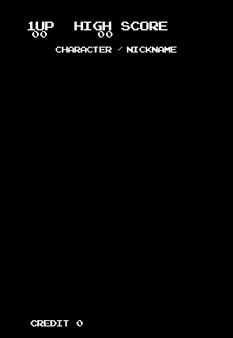

# PacMan

[](https://git.unistra.fr/chamaael/pec-men/-/commits/main)

This project is about re-developing the famous « PAC-MAN » game made by Namco and released in 1980.
Our version was made using C++ and the SDL library.

- Game rules : https://www.gamedeveloper.com/design/the-pac-man-dossier
- Coding style : https://google.github.io/styleguide/cppguide.html
- Model : https://www.youtube.com/watch?v=7O1OYQRqUag



Normal speed video accessible here : https://youtu.be/FxbC6NFKyzQ

- EL-CHAMAA Omar
- FREITAG Matthieu (Zapharaos)

## Linux

### Installation

```sh
sudo apt-get update
sudo apt install cmake g++ libsdl2-dev
```

### Usage
Set up the build environment
```sh
mkdir build && cd build
```

Build using cmake
```sh
cmake ..
make
```

Run the game
```sh
./PacMan
```

## Controls

- <kbd>&#8592;</kbd> : moving left
- <kbd>&#8593;</kbd> : moving up
- <kbd>&#8594;</kbd> : moving right
- <kbd>&#8595;</kbd> : moving down
- <kbd>SPACE</kbd> : pause/resume game

Enjoy !
